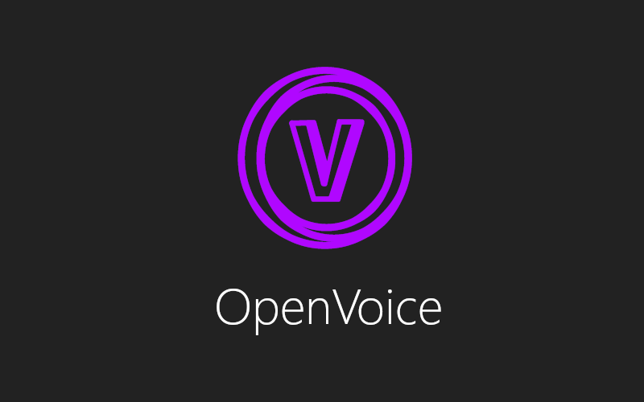

# OpenVoice

## About

OpenVoice is an app that allows you to use your phone's microphone as a microphone for your computer via Bluetooth or Wi-Fi.

## Downloads

* Windows (x64) : Download [Binary Release](https://github.com/JopaXd/openvoice-docs/releases/download/release/openvoice_desktop.rar).
* Android: Download [APK](https://github.com/JopaXd/openvoice-docs/releases/download/release/openvoice_android.apk).
* Android (Google Play): Coming soon.

## Issues/Questions

If you found an issue or have any questions, you can send me an email at pm_ov@pm.me!

## Author

Made by Pavle Milanov.