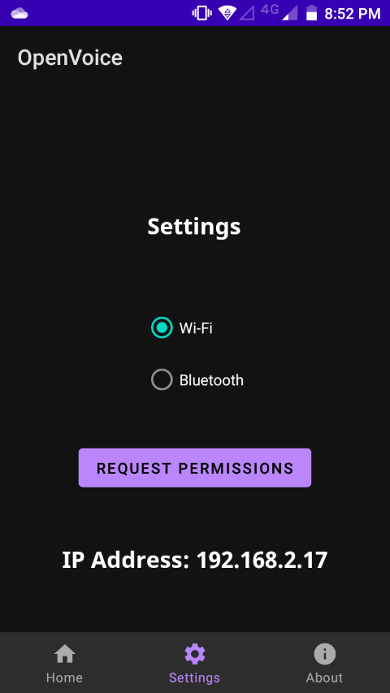
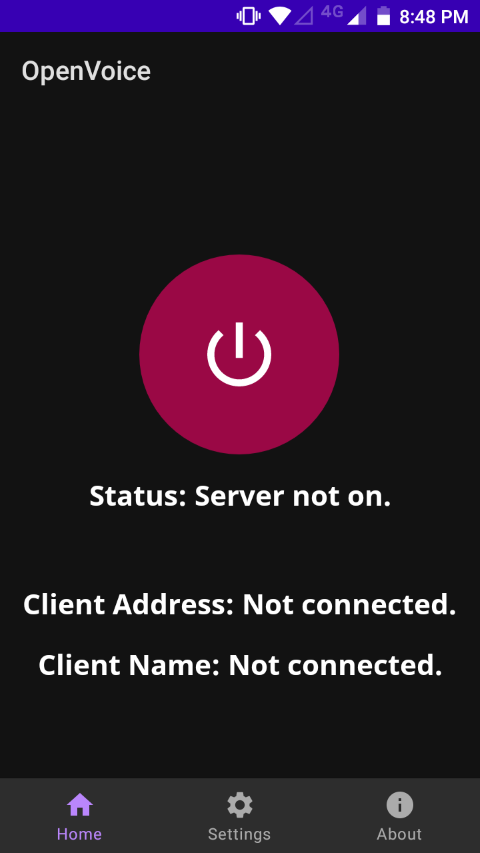
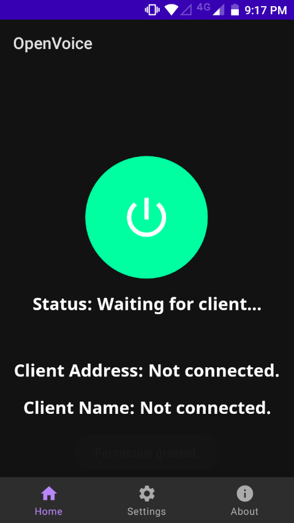
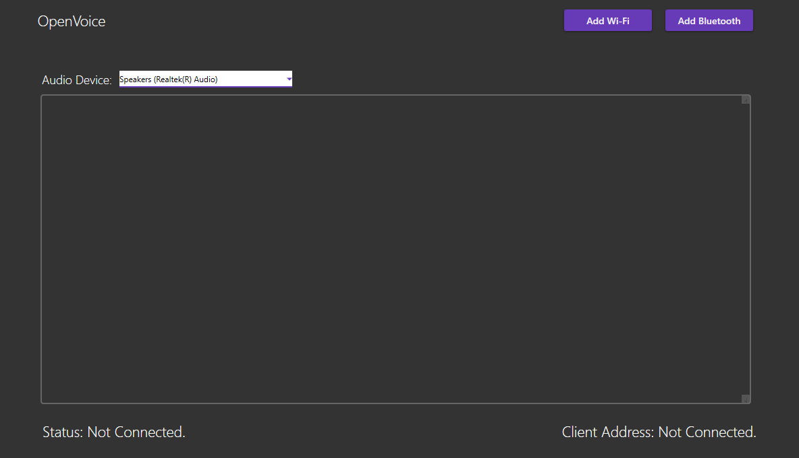
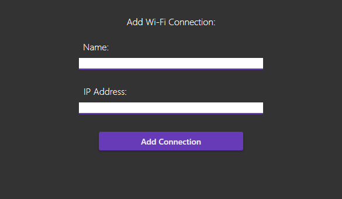
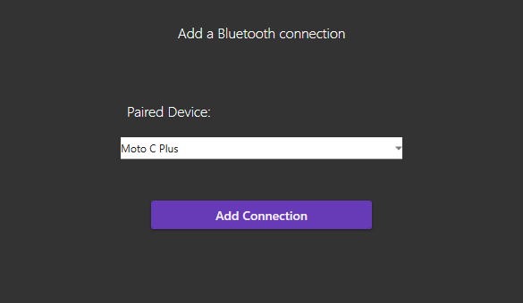
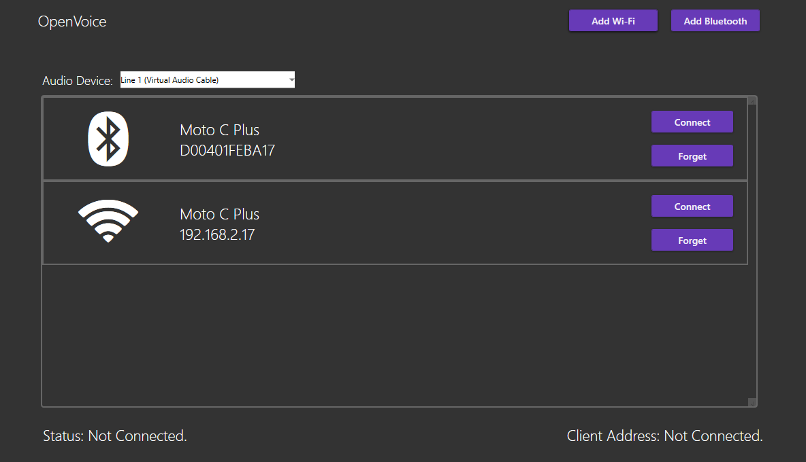
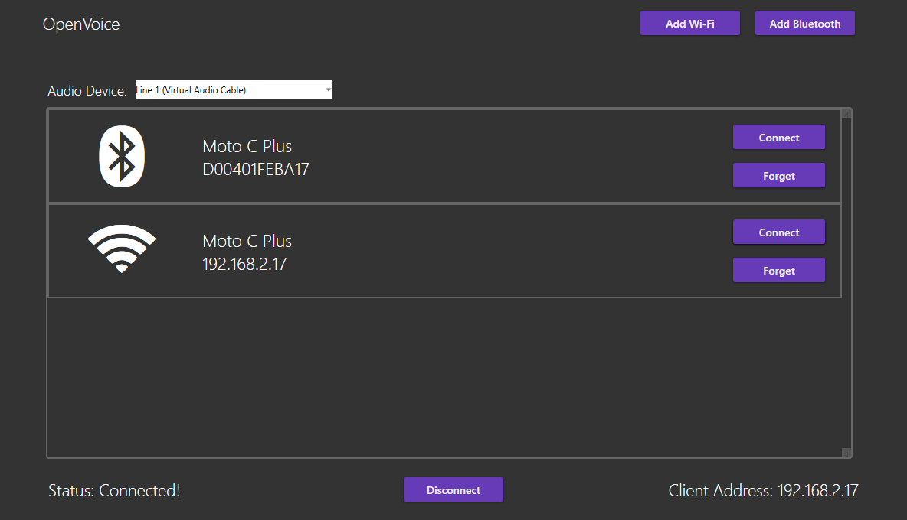

# Setup

## Virtual Audio Device

Upon downloading the Desktop and Mobile application, you'll need something called a Virtual Audio Device.

This Virtual Audio Device acts like a microphone that allows OpenVoice to send audio that it receives from your mobile device to it.

Here are the options i recommend, they are pretty straight forward to set up:

* [Virtual Audio Cable](https://vac.muzychenko.net/en/download.htm)
* [VB-Cable](https://vb-audio.com/Cable/)

After that, the fun part comes.

## Mobile Setup

Open the app and navigate to settings. Here you can choose whether you want to use Wi-Fi or Bluetooth. Neither has an advantage over the other.

Underneath that, you should see a "Request Permissions" button. When you click this, the app will ask for microphone permission. This step is necessary and the app can't function without it.

And at the bottom, you should see a label that shows your local IP Address. This is here if you decide to connect over Wi-Fi so you can figure out the IP of your mobile device easily.

After that, navigate back to home page.

Click on the power button.

Status should be "Waiting for client...".

And that's all there is on the mobile side.

Your phone is now waiting for your computer to connect.

## Desktop Setup

Open up the desktop app.

At the audio device select, choose the Virtual Audio Device you installed earlier.

Then, click on Add Wi-Fi connection, or Add Bluetooth Connection.

### Wi-Fi

In the name box, enter the name of the connection (this can be absolutely anything).

In the IP Address box, enter the IPv4 address of your mobile device.
As mentioned earlier, you can find it in the settings page of the mobile app.

Then click "Add Connection".

### Bluetooth

To add a Bluetooth connection, Bluetooth must be enabled, and your phone and computer must be paired. If you're not sure how to do this, give Google a quick search.

After pairing your phone with your computer, click on Add Bluetooth. You should see your mobile device in the list.

Then, after choosing the paired device, click "Add Connection".

## Final Steps

You're almost there.

After completing the steps above, the window should look something like this:

If you want to remove a connection, you can click the "Forget" button.

To connect to your mobile device, click "Connect".

If the status is "Connected!" on the desktop app and "Client connected!" on the phone app, this means you configured everything properly.

To use this in VOIP applications, change your input device to the Virtual Audio Device you installed earlier.

When you want to stop using the app, click on the "Disconnect" button on the desktop app, or simply click the power button on the mobile app to close the connection.